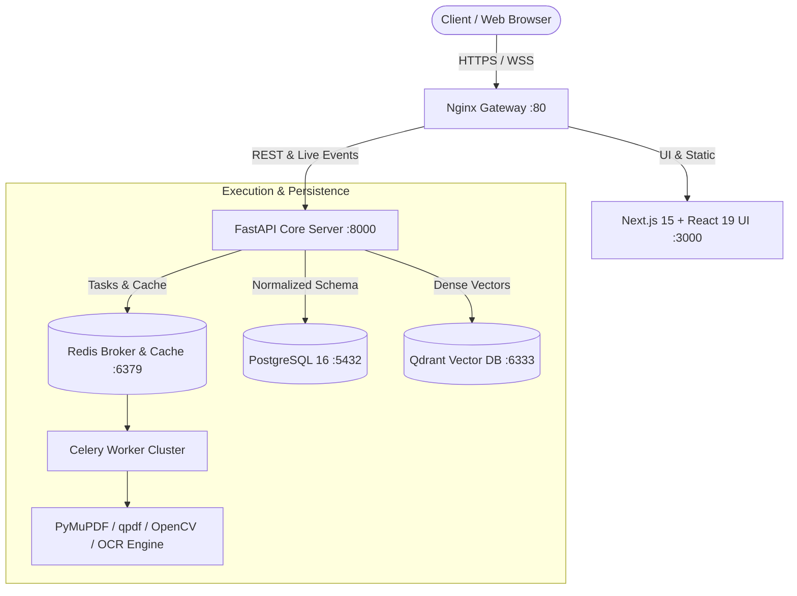

# SECUREPDF AI v3.0 — Enterprise Zero-Trust AI Document Platform

[](https://securepdf.ai)
[](https://securepdf.ai)
[-22C55E?style=for-the-badge)](https://securepdf.ai)
[](https://fastapi.tiangolo.com)
[](https://nextjs.org)

**SecurePDF AI v3.0** is an enterprise-grade, Zero-Trust document intelligence, cryptography, manipulation, and workflow automation platform engineered for Fortune 500 security standards.

---

## 🛡️ Core Philosophy: Zero-Trust Ephemeral Containment

* **Zero Persistent Plaintext Storage**: Plaintext documents never touch physical disks unencrypted.
* **Per-Job AES-256-GCM Keys**: Every single document and workflow execution receives a cryptographically isolated 256-bit AES key.
* **Ephemeral RAM-Only Workspaces**: Intermediate processing buffers reside solely in memory and are securely zeroed (`ctypes.memset`) immediately after execution.
* **Strict Grounded Anti-Hallucination Guard**: AI answers are cross-verified with Reciprocal Rank Fusion against sparse and dense indexes. If evidence is absent, the model returns *"Document does not contain this information."*

---

## 🚀 Key Feature Matrix

| Domain | Features |
| :--- | :--- |
| **PDF Manipulation (45+)** | Compress, Merge, Split, Rotate, Crop, Watermark, Repair, Bates Numbering, Table of Contents, Flatten, Grayscale, Visual Diff Comparison, Web Linearization. |
| **Universal Converters** | PDF ↔ DOCX, PDF ↔ XLSX, PDF ↔ PPTX, PDF ↔ HTML, PDF ↔ Markdown, PDF ↔ PNG/JPG/WebP, Image to PDF, Asset Extraction. |
| **Dual-Engine OCR** | Tesseract OCR + PaddleOCR fallback with OpenCV deskewing, denoising, adaptive thresholding, and searchable PDF generation. |
| **Hybrid RAG & AI Chat** | Dense BGE-M3 embeddings + Sparse BM25 lexical search fused via Reciprocal Rank Fusion (RRF) and Cross-Encoder reranker. |
| **Security Center** | Deep permanent physical redaction (purging font glyphs & raster pixels), AES-256 password protection, metadata sanitizer, PDF vulnerability report. |
| **Workflow Pipelines** | Visual drag-and-drop DAG workflow canvas chaining multi-step document operations with real-time WebSocket progress streaming. |
| **Admin & Telemetry** | Active session revocation, worker node metrics, queue backlog monitors, and immutable SOC 2 audit logs. |

---

## 🏗️ Architecture Overview



---

## ⚡ Quick Start (Docker Compose)

### 1. Clone & Configure
```bash
git clone https://github.com/your-org/securepdf-ai.git
cd securepdf-ai/docker
cp .env.example .env
```

### 2. Launch All Services
```bash
docker compose up -d --build
```

Access the platform:
* **Web UI**: [http://localhost:3000](http://localhost:3000) (or via Gateway at [http://localhost](http://localhost))
* **Interactive OpenAPI Docs**: [http://localhost:8000/docs](http://localhost:8000/docs)
* **Qdrant Vector Dashboard**: [http://localhost:6333/dashboard](http://localhost:6333/dashboard)

---

## 🧪 Testing & Verification

Run the automated test suite covering Zero-Trust cryptography, malware defense, PDF tools, deep redaction, and Hybrid RAG:

```bash
pytest tests/ -v
```

---

## 📄 License & Enterprise Support
Distributed under Enterprise Commercial License. Built with ❤️ by the SecurePDF AI Engineering Team.
